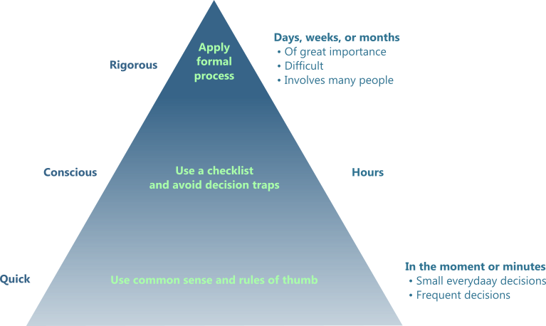

# prisma-decision-docs

"A decision is a choice between two or more alternatives that involves an irrevocable allocation of resources."[^1]

Decisions are the only way we can change our future life and for a company the only way to create value. Decisions are taken every days, some being simple and routine while others can be difficult and with strong impact. Having different levels of complexity, dynamic, and consequences, decisions thus require different analysis process. The figure (taken from [^1]) below illustrates this idea.

 

 

<em>Hierarchy of decisions showing the relationship between the complexity  of the decision, the required process and its required time.</em>

prisma-decision aims at helping for problems located at the top of the pyramid, meaning following a rigorous normative decision making process. It aims at reproducing the framework described in Bratvold and Begg (2010):

"A scalable decision-making framework broadly applicable to most decision situations: with or without uncertainty, multi-objective or single objective, single decision or linked decisions, personal or business. (...) Its principles can be applied to analyses that span a range of times from less than an hour to months or years."[^2]

## Application for decision analysis and decision quality

Making good decisions is challenging, among others due to
- Bias
- Lack of clarity
- Lack of decision-making culture
- Not innate process

Decision analysis can be seen as a dialogue between the [decision makers and the analysts](./domain/decision_roles.md), aiming first at providing insight and clarity. Decision makers can then choose the best course of action[^2].

prisma-decision is an application follows the principles of see [decision analysis (DA)](./domain/decision_analysis.md) and of [decision quality (DQ)](./domain/decision_quality.md), and is a collaborative tool. It consists of

1. A frontend allowing
    - Framing the decision opportunity
    - Structuring the decision model
    - Evaluating the decision model
1. A Backend allowing
    - Accessing all the decision data in a database
    - Computations on the decision models

On the computation part, the decision model is expressed as an [influence diagram](./domain/influence_diagram.md) which is solved using the [pyagrum package](https://pyagrum.readthedocs.io/en/stable/index.html). The influence diagram can be converted into a [decision tree](./domain/decision_tree.md) for interpretation purpose.
 

## Citing

## Licence

 
## References

[^1]: Howard R. A. and Abbas A. E. (2016). Foundations of Decision Analysis. Pearson Education 2016.

[^2]: Bratvold, R. B. and Begg, S. (2010). Making Good Decisions, Society of Petroleum Engineers,  DOI: https://doi.org/10.2118/9781555632588, ISBN electronic: 978-1-61399-948-6.