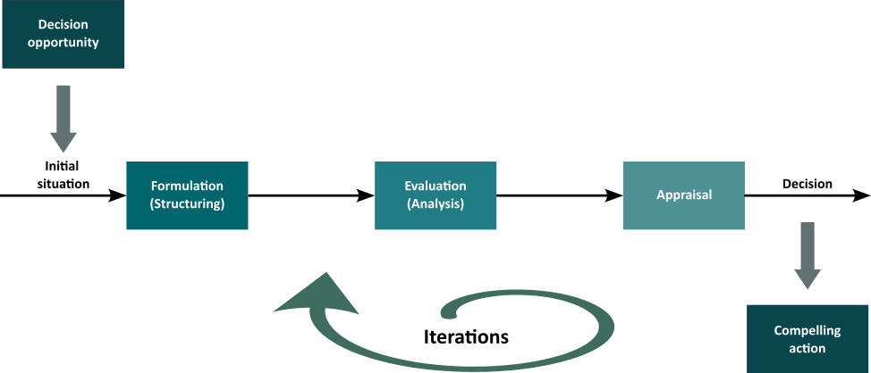
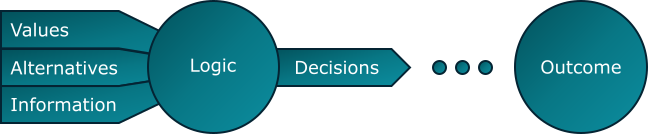

## Decision analysis

Decision analysis is a term that describes a combination of philosophy, methodology, practice, and application useful in the formal introduction of logic and preferences to the decisions of the world. Making a decision is allocating irreversibly resources, that is following a course of action. The [decision maker](./decision_roles.md) is supposed to do so in a world which is uncertain, complex, and dynamic[^1].

Decision analysis (DA) can be split in 3 steps[^2]

1. Formulation
1. Evaluation
1. Appraisal

It is an iterative process, where these 3 steps should be revisited until the best [decision quality](./decision_quality.md) is reached.

 

 

<em>The decision analysis iterative process.</em>

### Formulation phase

This phase answers the question "what is the decision you face?". There, the problem is defined and framed. A decision model composed of five elements is build. These elements can be identified in virtually all decision situations[^2]:
- Alternatives (or choices) to be decided among 
- Objectives (or criteria) and preferences for what we want 
- Information, which may include data and is usually uncertain 
- Payoffs (or outcomes, consequences) of each alternative for each objective 
- Decision, the ultimate choice among the identified alternatives

The 3 first elements are also called decision basis:
- Preferences: what do you want?
- Alternatives: What can you do?
- Information: What do you knw?

 

 

<em>The 5 elements of a decision model.</em>

Typically, the formulation phase would produce an [influence diagram](./influence_diagram.md) and/or a [decision tree](./decision_tree.md). In prisma-decision, on influence diagrams are build. The correspondig decision tree is computed from the influence diagram.

### Evaluation phase

This phase models the connection between the decision alternatives and the corresponding values. It can be

- Deterministic analysis
  - Value (business, dioscounted cash flow) models for the alternatives are developed
  - One-way sensitivity analysis to identif the uncertain factors that have siginificant impact on the consequences.
- Probabilistic analysis
  - Probability distributions of material factors are assessed
  - Risk profiles are generated
  - Risk aversion analysis
  - Best alternative is provisionally determined
  
Within This phase tornado plots for the sensitivity analysis could be produced, probability functions can be elicitated, risk attitude considered, the optimum strategy can be found...

> [!WARNING]
> This phase is only partially implemented in prisma-decision

### Appraisal phase

This phase evaluates how robust is the decision to changes in the inputs. It includes for example
- Sensitivity analysis
    - One-way sensitivity
    - two-way sensitivity
- Value of Infomation analysis
- Value of flexibility
- Decision quality assessment

> [!WARNING]
> This phase is not yet implemented in prisma-decision 

### See also
- [Decision quality](./decision_quality.md)
- [Decision roles](./decision_roles.md)

### References

[^1]: Howard, R. A. (1968). The foundation of Decision Analysis, IEEE Transactions on Systems Sciences and Cybernetics, Vol. SSC-4, No. 3.

[^2]: Bratvold, R. B. and Begg, S. (2010). Making Good Decisions, Society of Petroleum Engineers,  DOI: https://doi.org/10.2118/9781555632588, ISBN electronic: 978-1-61399-948-6.

*The description above is strongly inspired by the lecture of Pr. R. Bratvold at University of Stavanger*