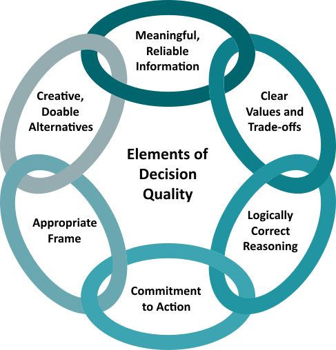
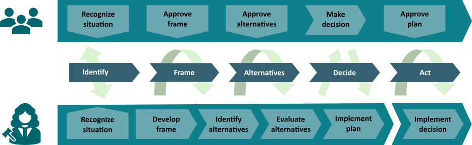

## Decision quality

The quality of a decision should be evaluated before the outcome of the decision is known. In particular, outcome quality should not be mistaken with decision quality!

The quality of a decision is evaluated on 6 elements. The quality of the decision is determined by the quality of the poorest element. 

 

 

<em>The 6 elements of decision quality.</em>

### Framing

A frame is a limited description of a problem that filters what is relevant. It addresses
- Clear purpose (what has to be solved?)
- Defined scope (boundaries)
- Conscious perspective (level of details)

A risk is to try to solve the problem immediately (plunging in), too narrow or too broad scope.

### Alternatives

Suggesting alternatives is the creative part of the decisiona analysis process. There, scenarios must be significantly different to allow an optimal value creation. 

Risks can be:
- Stay in comfort zone, don’t think outside the box (and thus miss valuable alternatives)
- Too similar scenarios (no real alternatives)

### Meaningful information

- Information can be expansive (new alternatives)
- Information can be reductive (reduce uncertainty)
- Understand uncertainty range
- Variable dependencies
- Value of information

**Remark:** Decision Analysis is concerned about an uncertainty only if it is able to change the decision.

Examples of risks are:
- Uncertainty ignored or biased
- Focus on what we know how to work on but not necessarily on what is important

### Value

Decision criteria to rank alternatives need to be defined. It is important to know why an alternative to a decision is prefered to another one. This is also about being clear on the desired created value from the decision process. It is possible to have several criteria, some being in conflict with others.

A risk here is to neglect some key stakeholders, to ignore the intangibles.

### Logical reasoning

This element addresses:
- Correctness of decision logic: Alternatives competing on equal basis and maturity level
- Uncertainties
- Complexity and achieves clarity of choice

 [Influence diagrams](./influence_diagram.md) and/or a [decision trees](./decision_tree.md) are useful tools for clear thinking. 

Common risks are
- Rely on intuition
- Ignore uncertainty
- Get mired in details and complexity

### Commitment to action

[Decision analysis](./decision_analysis.md) is an iterative process thich allows securing the quality of the decision process and building commitment to action. The [decision maker(s)](./decision_roles.md) needs to be involved in the framing and creation of alternatives as he (or they) owns them.

 

 

<em>Decision dialog between the decision maker and the team of exports.</em>

### See also
- [Decision analysis](./decision_analysis.md)
- [Decision roles](./decision_roles.md)

### References

*The description above is strongly inspired by the lecture of Pr. R. Bratvold at University of Stavanger*