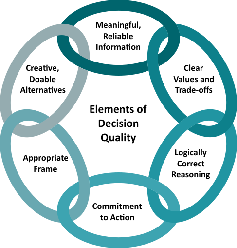
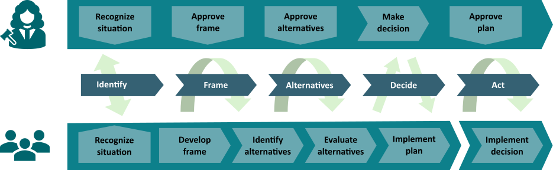

# Decision quality

Decision quality describes how well a decision is framed, evaluated, and prepared for action. Assess it before the outcome is known. A favorable outcome does not prove that the decision was well made, and an unfavorable outcome does not by itself prove that the decision process was poor.

Decision quality has six elements. The overall decision is constrained by its weakest element: a serious gap in one area can undermine the whole decision. Use the six elements to find gaps that further analysis or discussion could resolve and that could change the course of action.

<em>The six elements of decision quality.</em>

## The six elements

### 1. Appropriate Frame

**Purpose:** Define the right decision problem, its purpose, scope, boundaries, and perspective. A frame describes what is relevant to the decision and at what level of detail.

**Examine:** Is the decision question clear? Are the objectives, decision-makers, and boundaries explicit? Is the scope too broad or too narrow? Are the underlying assumptions and the "do nothing" case considered?

**Common failure modes:** Starting to solve the problem before agreeing what it is; addressing a symptom instead of the root issue; or excluding important objectives, stakeholders, or parts of the problem.

### 2. Creative, Doable Alternatives

**Purpose:** Develop sufficiently distinct options that are both achievable and capable of creating value. Comparing alternatives is what makes it possible to choose among different courses of action.

**Examine:** Are the options meaningfully different? Are they feasible? Have the status quo, hybrid approaches, and unconventional options been considered where relevant?

**Common failure modes:** Considering only one option; comparing minor variations of the same idea; or settling on a preferred option before exploring other possibilities.

### 3. Meaningful, Reliable Information

**Purpose:** Use relevant, trustworthy information to create alternatives and reduce uncertainty that matters to the decision.

**Examine:** What is known and uncertain? Are assumptions supported by current, credible evidence? Are dependencies between important variables understood? Would obtaining more information be worth its cost?

Decision analysis focuses on uncertainty when resolving it could change the choice. The **value of information** is the benefit of obtaining information that could improve the decision.

**Common failure modes:** Ignoring or biasing uncertainty; relying on weak evidence; or spending effort on information that does not affect the decision while leaving important uncertainties unresolved.

### 4. Clear Values and Trade-offs

**Purpose:** Make explicit what outcomes matter and how alternatives will be compared. A decision can involve several criteria that conflict with one another.

**Examine:** Are the decision criteria clear and prioritized? Do stakeholders agree on the desired value and acceptable risks? Are trade-offs and less tangible considerations acknowledged?

Examples of trade-offs include value versus safety, value versus emissions, value versus schedule, cost versus optionality, and short-term versus long-term value.

**Common failure modes:** Leaving success criteria undefined; overlooking important stakeholders or intangible values; or allowing hidden objectives and unresolved priorities to drive the choice.

### 5. Logically Correct Reasoning

**Purpose:** Connect the available information, assumptions, uncertainties, and values to a clear choice. Alternatives should be compared on a fair basis and at a comparable level of maturity.

**Examine:** Is the reasoning transparent? Have assumptions, uncertainty, and relevant scenarios been considered? Does the recommendation follow from the analysis? Is the choice robust to changes in important assumptions?

[Influence diagrams](./influence_diagram.md) and [decision trees](./decision_tree.md) can help represent dependencies and clarify the logic of a decision.

**Common failure modes:** Relying on intuition without examining it; ignoring uncertainty; comparing alternatives inconsistently; or becoming lost in detail without clarifying the choice.

### 6. Commitment to Action

**Purpose:** Build ownership of the decision and prepare the organization to carry it out. Commitment is strengthened when decision-makers take part in framing the problem and developing alternatives.

**Examine:** Do decision-makers and stakeholders support the decision? Are responsibilities, resources, risks, and implementation needs understood? Can the people responsible for action explain what was decided and why?

Decision analysis is iterative: discussion between decision-makers and analysts can improve the analysis while building shared understanding and commitment.

**Common failure modes:** Producing a sound analysis without clear ownership; overlooking implementation barriers; or involving decision-makers only after the important choices have already been made.

<em>Decision-makers and analysts interact throughout the decision process. Their dialogue supports both analysis and commitment to action.</em>

## Related concepts

- [Decision analysis](./decision_analysis.md)
- [Decision roles](./decision_roles.md)

## Reference

*This description is strongly inspired by a lecture by Professor R. B. Bratvold at the University of Stavanger.*