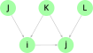
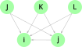
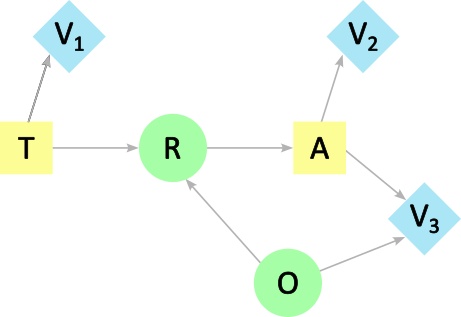
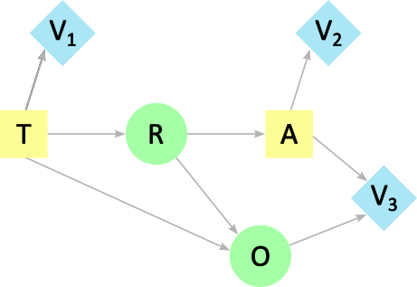

## Arc reversal in ID to DT conversion

### Theoretical considerations

The general rules for converting an influence diagram (ID) to a decision tree (DT) can be found in [^1]. There, among others, 2 definitions are introduced
- A *decision network* is an influence diagram:
  - which implies a total ordering among decision nodes (single decision maker),
  - where each decision node and its direct predecessors directly influence all successor decision nodes (no-forgetting assumption).
- A *decision-tree network* is a decision network:
  - where all predecessors of each decision node are direct predecessors. (It assures a decision tree can be constructed in direct correspondence with the influence diagram.)

A decision-tree network is a network for which every node with a path to a decision node, $d$, is observed at the time of the decision $d$.

Converting an influence diagram into a decision-tree network requires reversing arcs [^1][^2]. 
An arrow joining two nodes in an influence diagram may be reversed provided that all probability assignments are based on the same set of information. Thus, the first step in this reversal is to assure that these nodes have a common information state. 

Reversing an arc between 2 chance nodes in an ID $X\rightarrow Y$ to $Y\rightarrow X$, is equivalent to applying the Bayes' theorem
Converting an influence diagram into a decision-tree network requires reversing arcs [^1][^2]. Reversing an arc between 2 chance nodes in an ID $X\rightarrow Y$ to $Y\rightarrow X$, is equivalent to applying the Bayes' theorem

$$
P(Y \mid X) = \frac{P(Y)}{P(X)}P(X \mid Y).
$$

$P(X)$ is the marginal distribution defined by

$$
P(X) = \sum_{y\in Y} P(X \mid Y=y)P(Y=y).
$$

This can easily be extended to the case of a node with several parents (as long as no cycle is created). We use the case described by Shachter (1990)[^2]

 

*Probabilistic influence diagram from Shachter (1990).*

In the case represented above, both nodes $i$ and $j$ have several parents. Let's see the case where we want to reverse the arc to $j\rightarrow i$.

We follow[^2] and set

- $C(i)^{old}$ are the parents of $i$ before the arc reversal
- $C(j)^{old}$ are the parents of $j$ before the arc reversal

and

$$
H = C(i)^{old}\cup C(j)^{old} \setminus\lbrace i\rbrace.
$$

The joint distribution is thus

$$
P(i,j,H) = P\left(i\mid C(i)^{old}\right)P\left(j\mid i, C(j)^{old}\setminus \lbrace i \rbrace \right)P(H), 
$$

and since we have both $C(i)^{old} \subseteq H$ and $C(j)^{old}\setminus\lbrace i\rbrace \subseteq H$, this can be rewritten as

$$
\begin{align*}
P(i,j,H) 
  & = P(i\mid H)P(j\mid i, H)P(H), \\
  & = P(j\mid H)P(i\mid j, H)P(H), 
\end{align*}
$$

so

$$
P(j\mid i, H) = \frac{P(j\mid H)}{P(i\mid H)}P(i\mid j, H),
$$

with

$$
P(i\mid H) = \sum_{j'} P(i \mid j', H)P(j'\mid H).
$$

This is the Bayes' theorem.

**Remark:**

In the above, introducing the dependency to all the common parents $H$ means that extra arcs have been added $(J\rightarrow j \text{ and } L\rightarrow i)$. These only represent the possibility of dependency and not an existing one. This means that 

$$
P(i\mid H) = P(i \mid J,K,L) := P(i\mid J,K).
$$

It is necessary to have it in $H$ as we have $L\rightarrow j \rightarrow i$, meaning $L$ affects $i$ indirectly. 

 

*Probabilistic influence diagram from Shachter (1990) after arc reversal to* $j \rightarrow i$.

A condition for deciding about the need of reversing arcs is given in[^2]: 

 

> Any regular influence diagram can be transformed to a decision-tree network 
by this process: While there is a reversible arc from a chance node in one 
decision window to a chance node in an earlier decision window, reverse the 
arc. 

A decision window contains the chance nodes observed for the first time between two consecutive decisions (see [Partial order](./partial_order.md)).

### Example

Let's consider the used car buyer problem represented on the Figure below.

 

*Influence diagram of the used car buyer problem. T is the decision of testing or not, A is the decision of purchasing, R is the result of the test, O is the initial state of the car, and V1, V2, and V3 are the cost of the test, the profit of the car and the maintenance costs.*

The decisions windows are

$$
W_1 = \emptyset, W_2 = {R}, W_3 = {O},
$$

which gives the partial order

$$
T \preceq R \preceq A \preceq O
$$  

In the influence diagram, there is an arc from the state of the car, $O$, and the test results, $R$. $R$ is found in an earlier decision window than $O$, and the arc from $O \rightarrow R$ needs to be reversed when converting to a DT (meaning applying the Bayes' theorem).

We have (for example)

| $P(O)$ | soaking | wet | dry |
|--------|---------|-----|-----|
|        |  0.2    | 0.3 | 0.5 |

and 

| $P(R \mid O)$ | closed  | open  | diffuse |
|-----------|---------|-------|---------|
|   soaking | 0.5     |  0.4  |   0.1   |
|   wet     | 0.3     |  0.4  |   0.3   |
|   dry     | 0.1     |  0.3  |   0.6   |

And we therefore compute $P(O \mid R)$ as

$$
P(O \mid R) = \frac{P(O)}{P(R)}P(R \mid O),
$$

and the marginal distribution defined by

$$
P(R) = \sum_{o\in O} P(R|O)P(O),
$$

that is

$$
\begin{align*}
P(R) & = P(R \mid O=\text{soaking})P(O=\text{soaking}) \\
    & \qquad + P(R \mid O=\text{wet})P(O=\text{wet}) \\
    & \qquad + P(R \mid O=\text{dry})P(O=\text{dry}),
\end{align*}
$$

which gives

$$
\begin{align*}
P(R=\text{closed}) & = 0.5\times0.2 + 0.3\times0.3 + 0.1\times0.5 = 0.24, \\
P(R=\text{open})   & = 0.4\times0.2 + 0.4\times0.3 + 0.3\times0.5 = 0.35, \\
P(R=\text{diffuse}) & = 0.1\times0.2 + 0.3\times0.3 + 0.6\times0.5 = 0.41.
\end{align*}
$$

The marginal distributions are thus 

| $P(R)$ | closed  | open | diffuse |
|--------|---------|------|---------|
|        |  0.24   | 0.35 |  0.41   |

Then, the full probability $P(O \mid R)$ can be computed as

$$
\begin{align*}
P(O=\text{soaking}\mid R=\text{closed})  
  & = P(R=\text{closed} \mid O=\text{soaking}) P(O=\text{soaking}), \\
  & = 0.5 \times 0.2 / 0.24, \\
  & = 0.42. \\
P(O=\text{wet} \mid R=\text{closed})        
  & = P(R=\text{closed} \mid O=\text{wet}) P(O=\text{wet}), \\
  & = 0.3 \times 0.3 / 0.24, \\
  & = 0.37. \\
P(O=\text{dry} \mid R=\text{closed})      
  & = P(R=\text{closed} \mid O=\text{dry}) P(O=\text{dry}), \\
  & = 0.1 \times 0.5 / 0.24, \\
  & = 0.21. \\
P(O=\text{soaking} \mid R=\text{open})    
  & = P(R=\text{open} \mid O=\text{soaking}) P(O=\text{soaking}), \\
  & = 0.4 \times 0.2 / 0.35, \\
  & = 0.23. \\
P(O=\text{wet} \mid R=\text{open})        
  & = P(R=\text{open} \mid O=\text{wet}) P(O=\text{wet}), \\
  & = 0.4 \times 0.3 / 0.35, \\
  & = 0.34. \\
P(O=\text{dry} \mid R=\text{open})        
  & = P(R=\text{open} \mid O=\text{dry}) P(O=\text{dry}), \\
  & = 0.3 \times 0.5 / 0.35, \\
  & = 0.43. \\
P(O=\text{soaking} \mid R=\text{diffuse}) 
  & = P(R=\text{diffuse} \mid O=\text{soaking}) P(O=\text{soaking}), \\
  & = 0.1 \times 0.2 / 0.41, \\
  & = 0.05. \\
P(O=\text{wet} \mid R=\text{diffuse})     
  & = P(R=\text{diffuse} \mid O=\text{wet}) P(O=\text{wet}), \\
  & = 0.3 \times 0.3 / 0.41, \\
  & = 0.22. \\
P(O=\text{dry} \mid R=\text{diffuse})     
  & = P(R=\text{diffuse} \mid O=\text{dry}) P(O=\text{dry}), \\
  & = 0.6 \times 0.5 / 0.41 \\
  & = 0.73. \\
\end{align*}
$$

and 

| $P(O \mid R)$ | soaking  | wet    | dry      |
|-----------|----------|--------|----------|
|   closed  | 0.42     |  0.37  |   0.21   |
|   open    | 0.23     |  0.34  |   0.43   |
|   diffuse | 0.05     |  0.22  |   0.73   |

 
 

**Remarks:**

In the influence diagram above, there is a path from the state of the car, $O$ to the purchase decision, $A$, while $O$ is *not* observed at the time of $A$. This influence diagram is thus not a decision tree network. If we would have modelled the used car buyer problem with an arc $R \rightarrow O$ (thus deducing the possible state of the car from the test results), it would then be the equivalent decision tree network to the influence diagram shown above.

 

*Decision tree network of the used car buyer problem. T is the decision of testing or not, A is the decision of purchasing, R is the result of the test, O is the initial state of the car, and V1, V2, and V3 are the cost of the test, the profit of the car and the maintenance costs.*

In that case, we have the same partial order, but $R$ points to the chance node $O$ which is _not_ in an earlier decision window. Therefore, no arc reversal has to be done.

It is worth noticing that one of the advantages of influence diagrams (ID) to decision trees (DT) is that probabilities can be entered as observed. For example, we can naturally model the causality or the way conditional probabilities are measured, as for example, observing symptoms given the possible prevalence of a disease. The DT may use the reciprocal conditional probability and the brute-force conversion by computing the joint may be intractable in problems that have many chance variables [^3].

### See also
- [Influence diagram](./influence_diagram.md)
- [Decision tree](./decision_tree.md)
- [Partial order](./partial_order.md)

### References

[^1]: Howard, Ronald A., and Matheson, James E. (2005) *Influence Diagrams*. Decision Analysis 2(3):127-143.
https://doi.org/10.1287/deca.1050.0020

[^2]: Shachter, Ross. (1990) *An Ordered Examination of Influence Diagrams*. Networks. 20. 535 - 563. 10.1002/net.3230200505.
[@ResearchGate](https://www.researchgate.net/publication/227656993_An_Ordered_Examination_of_Influence_Diagrams)

[^3]: Shenoy, Prakash. (2000) *Valuation network representation and solution of asymmetric decision problems*. European Journal of Operational Research. 121. 579-608.
[@ResearchGate](https://www.researchgate.net/publication/29441258_Valuation-Based_Systems_for_Bayesian_Decision_Analysis)
