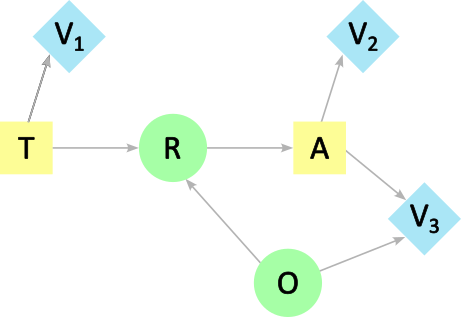

## Partial order

### Definition

A strong connection between partial orderings and directed (acyclic) graphs exists[^1] and ordering elements of an [influence diagram](./influence_diagram.md) may be an important step in the analysis. 

A *binary relation* on a finite set of elements $N$ compares pairs of elements from $N$. For the binary relation $\preceq$, let's consider the properties:
 

- Reflexive: $x \preceq x$ for all $x \in N$; 
- Transitive: if $x \preceq y$ and $y \preceq z$, then $x \preceq z$ for all $x, y, \text{ and } z \in N$; 
- Antisymmetric: if $x \preceq y$ and $y \preceq x$, then $x$ is $y$ for all $x$ and $y \in N$;  
- Complete: $x \preceq y$ and/or $y \preceq x$ for all $x$ and $y \in N$. 

The relation $\preceq$ is a partial ordering if it is reflexive, transitive, and antisymmetric. A partial ordering is a total ordering if it is also complete. 

### Algorithm

Given the $m$ decision nodes $d_1, d_2, \ldots d_m$ in the influence diagram and assuming they are completely ordered (regularity constraint of the influence diagram), we have $m+1$ *decision windows*. A decision
window, $W_j$ contains the chance nodes observed for the first time between the decision $d_{j-1}$ and $d_{j}$.
Chance nodes that are never observed are included with those observed 
after the last decision in $W_{m+1}$. The windows partition then all of the chance nodes.

This leads to the algorithm (notice the elimination order is the reversed version of the desired partial order)

> ---
> Algorithm: Compute a partial order of an influence diagram
> ---
> 1. **Inputs:** An influence diagram without value nodes and a decision order, $\mathcal D$
> 1. **Initialize:** Elimination order, ${\mathcal O} = \emptyset$
> 1. **for** each decision $d$ of $\mathcal D$ taken in reverse order **do**
> 1. &nbsp;&nbsp;&nbsp;&nbsp; Find all chance nodes, $\mathcal C$, in the decision window preceeding $d$
> 1. &nbsp;&nbsp;&nbsp;&nbsp; ${\mathcal O} \leftarrow {\mathcal O} \cup \{d\}$
> 1. &nbsp;&nbsp;&nbsp;&nbsp; ${\mathcal O} \leftarrow {\mathcal O} \cup {\mathcal C}$
> 1. &nbsp;&nbsp;&nbsp;&nbsp; ${\mathcal D} \leftarrow {\mathcal D} \setminus \{d\}$
> 1. **end for**
> 1. Add all reminding chance nodes to ${\mathcal O}$
> 1. $\preceq \leftarrow$ Reverse(${\mathcal O}$)
> 1. **Return** $\preceq$
> ---

 

The figure below represents the influence diagram for the used car buyer problem.

 
 

*Influence diagram of the used car buyer problem. T is the decision of testing or not, A is the decision of purchasing, R is the result of the test, O is the initial state of the car, and V1, V2, and V3 are the cost of the test, the profit of the car and the maintenance costs.*

The decisions windows are

$$
W_1 = \emptyset, W_2 = {R}, W_3 = {O},
$$

which gives the partial order

$$
T \preceq R \preceq A \preceq O
$$  

### See also
- [Influence diagram](./influence_diagram.md)
- Topological order
- Decision tree
- Junction tree

### References

[^1]: Shachter, Ross. (1990). An Ordered Examination of Influence Diagrams. Networks. 20. 535 - 563. 10.1002/net.3230200505.
[@ResearchGate](https://www.researchgate.net/publication/227656993_An_Ordered_Examination_of_Influence_Diagrams)