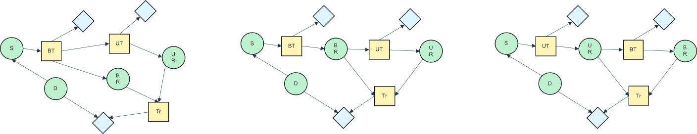

## pyagrum

The [pyagrum package](https://pyagrum.readthedocs.io/en/stable/index.html)[^1] is used for solving influence diagrams in prisma-decision. This means it actually deal with [Limited Memory Influence Diagrams (LIMIDs)](./limid.md) and evaluate the optimum policy using the Single Policy Update method based on the Shafer-Shenoy architecture[^2][^3][^4]. 

The implications for prisma-decision are

- The decision model should be represented as a LIMID with exact solution ordering
- Asymmetry cannot be represented
    - Order asymmetry should be investigated by using one LIMID per possible order
    - Domain and information asymmetry (also called functional and structural) need to be represented by the probability and utility tables.

The diabetes problem, where the order between the urin test and the blood test is unknown can be represented by the 3 cases

 

 

<em>Influence diagrams for the order asymmetric diabetes problem. S stands for symptomes, D for diabetes, BT for blood test, UT for urine test, BR for blood test result, UR for urine test result, and Tr for treatment. Left is the case  where the blood test and the urine test are performed indepentely (no dependence on the test results), middle,  where the blood test is done before the urine test with dependence on the test result, and right,  where the urine test is done before the blood test with dependence on the test result</em>

The domain and information asymmetry cases can be expressed as restrictions on the values of the uncertainty and utility nodes. This means the numerical values in the tables need to express the case (or cases) are not possible.
For example, a total restriction on an uncertainty node with initial probability

<table style="background-color:#D3D3D3;">
  <tr>
    <th style="background-color:#FFFFFF;"></th>
    <th colspan="2">Diabetes</th>
  </tr>
  <tr>
    <th>Test result</th>
    <th>Present</th>
    <th>Absent</th>
  </tr>
  <tr>
    <th>Positive</th>
    <td style="background-color:#90EE90;">0.02</td>
    <td style="background-color:#90EE90;">0.96</td>
  </tr>
  <tr>
    <th>Negative</th>
    <td style="background-color:#90EE90;">0.98</td>
    <td style="background-color:#90EE90;">0.04</td>
  </tr>
</table>

can be represented as

<table style="background-color:#D3D3D3;">
  <tr>
    <th> Blood test? 
    <th colspan="2">Yes</th>
    <th colspan="2">No</th>
  </tr>
  <tr>
    <th>Diabetes</th>
    <th>Present</th>
    <th>Absent</th>
    <th>Present</th>
    <th>Absent</th>
  </tr>
  <tr>
    <td>Positive</td>
    <td style="background-color:#FAA0A0;">0</td>
    <td style="background-color:#FAA0A0;">0</td>
    <td style="background-color:#90EE90;">0.02</td>
    <td style="background-color:#90EE90;">0.96</td>
  </tr>
  <tr>
    <td>Negative</td>
    <td style="background-color:#FAA0A0;">0</td>
    <td style="background-color:#FAA0A0;">0</td>
    <td style="background-color:#90EE90;">0.98</td>
    <td style="background-color:#90EE90;">0.04</td>
  </tr>
  <tr>
    <td>NA</td>
    <td style="background-color:#FAA0A0;">1</td>
    <td style="background-color:#FAA0A0;">1</td>
    <td style="background-color:#90EE90;">0</td>
    <td style="background-color:#90EE90;">0</td>
  </tr>
</table>
 

Similarly a partial restriction on a utility node 
with values
<table>
  <tr>
    <th style="background-color:#9A9A9A; color:#FFFFFF;">Build decision</th>
    <th style="background-color:#D3D3D3; color:#555555;">Gain</th>
  </tr>
  <tr>
    <th style="background-color:#9A9A9A; color:#FFFFFF;">None</th>
    <td style="background-color:#D3D3D3;">0</td>
  </tr>
  <tr>
    <th style="background-color:#9A9A9A; color:#FFFFFF;">Conventional</th>
    <td style="background-color:#D3D3D3; ">-1MUSD</td>
  </tr>
  <tr>
    <th style="background-color:#9A9A9A; color:#FFFFFF;">Advanced</th>
    <td style="background-color:#D3D3D3; ">-5MUSD</td>
  </tr>
</table>
for which only one value is not possible can be represented as 
<table>
  <tr>
    <th style="background-color:#666666;color:#FFFFFF;"> Test result
    <th style="background-color:#9A9A9A; color:#FFFFFF;">Build decision</th>
    <th style="background-color:#D3D3D3; color:#555555;">Gain</th>
  </tr>
  <tr>
    <th  rowspan="3", style="background-color:#666666; color:#DDDDDD;"> Bad 
    <th style="background-color:#9A9A9A; color:#FFFFFF;">None</th>
    <td style="background-color:#D3D3D3;">0</td>
  </tr>
  <tr>
    <th style="background-color:#9A9A9A; color:#FFFFFF;">Conventional</th>
    <td style="background-color:#D3D3D3; ">-1MUSD</td>
  </tr>
  <tr>
    <th style="background-color:#9A9A9A; color:#FFFFFF;">Advanced</th>
    <td style="background-color:#FAA0A0; ">-&infin;MUSD</td>
  </tr>
  <tr>
    <th  rowspan="3", style="background-color:#666666; color:#DDDDDD;"> Good 
    <th style="background-color:#9A9A9A; color:#FFFFFF;">None</th>
    <td style="background-color:#D3D3D3;">0</td>
  </tr>
  <tr>
    <th style="background-color:#9A9A9A; color:#FFFFFF;">Conventional</th>
    <td style="background-color:#D3D3D3; ">-1MUSD</td>
  </tr>
  <tr>
    <th style="background-color:#9A9A9A; color:#FFFFFF;">Advanced</th>
    <td style="background-color:#D3D3D3; ">-5MUSD</td>
  </tr>
  <tr>
    <th  rowspan="3", style="background-color:#666666; color:#DDDDDD;"> Excellent 
    <th style="background-color:#9A9A9A; color:#FFFFFF;">None</th>
    <td style="background-color:#D3D3D3;">0</td>
  </tr>
  <tr>
    <th style="background-color:#9A9A9A; color:#FFFFFF;">Conventional</th>
    <td style="background-color:#D3D3D3; ">-1MUSD</td>
  </tr>
  <tr>
    <th style="background-color:#9A9A9A; color:#FFFFFF;">Advanced</th>
    <td style="background-color:#D3D3D3; ">-5MUSD</td>
  </tr>
</table>
 

> [!WARNING]
> It is not currently possible to use the `addNoForgettingAssumption` method, as not exposed in the frontend. Thus only IDs can be currently solved.

> [!WARNING]
> It is not currently possible to force decisions or evidences

> [!NOTE]
> pyagrum returns the maximum expected value (MEU) and the standard deviation of the utility. This is computed by summing the MEU and standard deviation for each decision nodes. While this is correct for the MEU, it is only correct for the standard deviation when the variables are independent. This is the case, for example, for the used car buyer problem where the maintenance costs and the total reward are dependent of each other as they will be both impacted by the type of contract. prisma-decision thus only returns the MEU.

### See also

- [Influence diagram](./influence_diagram.md)
- [LIMID](./limid.md)
  

### References

[^1]: Ducamp, G., Gonzales, C.,Wuillemin, P.-H. (2020). aGrUM/pyAgrum : a Toolbox to Build Models and Algorithms for Probabilistic Graphical Models in Python, International Conference on Probabilistic Graphical Models, Skørping, Denmark. [@HAL](https://hal.science/hal-03135721v1)

[^2]: Lauritzen, S. L., and Nilsson, D. (2001). Representing and Solving Decision Problems with Limited Information. Management Science. 47. (9) 1235 - 1251. 10.1287/mnsc.47.9.1235.9779. [@ResearchGate](https://www.researchgate.net/publication/2368443_Representing_and_Solving_Decision_Problems_with_Limited_Information)

[^3]: Nilsson, D., and Lauritzen, S. L. (2000). Evaluating influence diagrams using LIMIDs. Proceedings of the 16th Conference on Uncertainty in Artificial Intelligence, (eds.), Boutilier, C. and Goldszmidt, M., 436 - 445, [@ResearchGate](https://www.researchgate.net/https://www.researchgate.net/publication/234140127_Evaluating_influence_diagrams_using_LIMIDs),
[@arxiv](https://arxiv.org/pdf/1301.3881)

[^4]: Madsen, A. L., and Nilsson, D. (2001). Solving Influence Diagrams using HUGIN, Shafer-Shenoy and Lazy Propagation. Proceedings of the 17th Conference in Uncertainty in Artificial Intelligence, Morgan Kaufmann Publishers Inc., 337 – 345, [@ResearchGate](https://www.researchgate.net/publication/234108833_Solving_Influence_Diagrams_using_HUGIN_Shafer-Shenoy_and_LazyPropagation),
[@arxiv](https://arxiv.org/pdf/1301.2291)

